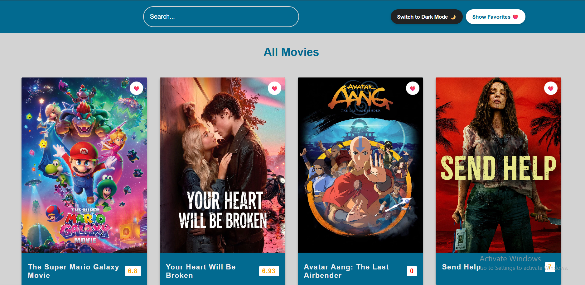
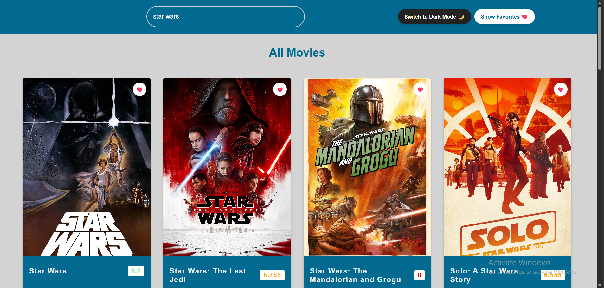
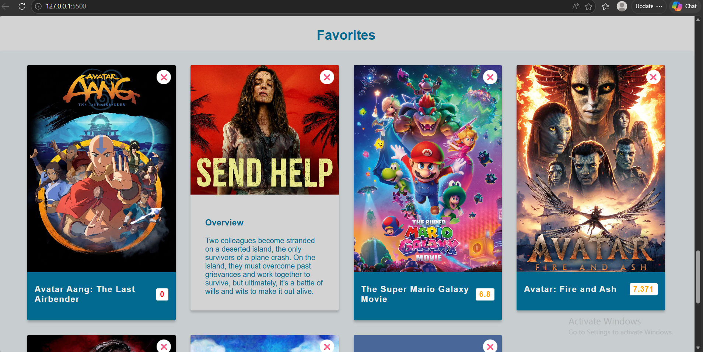
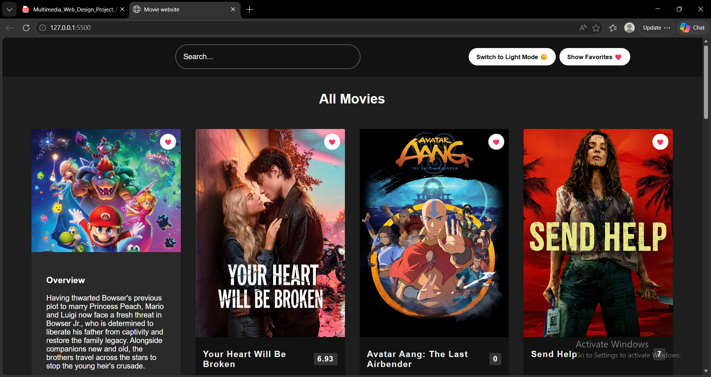
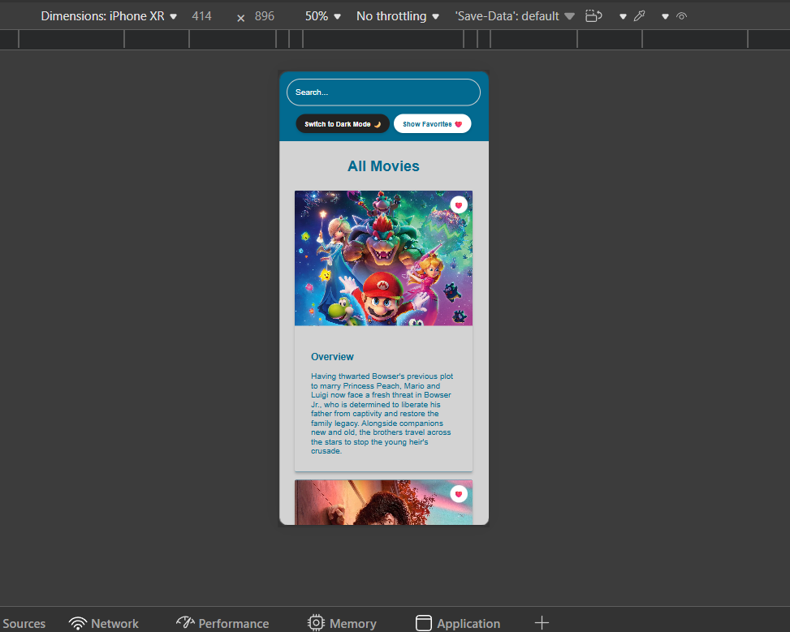
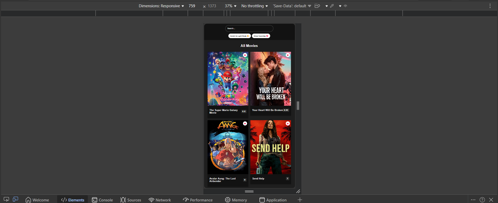

# movie-website

## Project Description
Movie Explorer is a responsive webpage that allows users to browse, search, and explore movies using real-time data from The Movie Database (TMDB) API. Users can view movie details such as posters, ratings, and overviews, and save their favorite movies using browser LocalStorage.

The project focuses on frontend development, API integration, and interactive user experience using JavaScript and jQuery.

## Objectives
- Build a responsive and interactive web application
- Integrate an external API using Fetch API
- Use JavaScript and jQuery for interactivity and animations
- Implement a favorites system using LocalStorage
- Create a clean and user-friendly UI/UX design
- Practice GitHub version control with meaningful commits

## Features
- Display popular movies from TMDB API
- Search movies by title
- View movie details (poster, rating, overview)
- Add/remove movies from favorites
- Persistent favorites using LocalStorage
- Toggle favorites section visibility
- Responsive design for mobile, tablet, and desktop
- Smooth animations using jQuery

## Technologies Used
- HTML5
- CSS3 (Flexbox, Grid, Media Queries)
- JavaScript 
- jQuery
- Fetch API
- TMDB API
- LocalStorage

##  API Information
This project uses The Movie Database (TMDB) API.

- Popular movies endpoint:
https://api.themoviedb.org/3/discover/movie

- Search endpoint:
https://api.themoviedb.org/3/search/movie

##  Project Structure
- index.html → Main HTML structure  
- style.css → Styling and responsive design  
- script.js → JavaScript logic and jQuery functionality  
- README.md → Project documentation  

##  Data Storage
This project uses browser LocalStorage to store favorite movies. No backend database is used.

## How to Run the Project
1. Download or clone the repository  
2. Open the project folder  
3. Open `index.html` in a browser  
No installation or setup required.

## Team Members
- Arta Livareka (Individual Project)

## Screenshots

### Home Page

### Search Feature

### Favorites Section

### Dark Mode

### Phone View

### Tablet View

## Key Features Implemented
- Fetch API for retrieving movie data
- jQuery animations (fadeToggle, scroll animation, text toggle)
- Responsive grid layout
- LocalStorage-based favorites system
- Duplicate prevention in favorites
- Interactive UI with hover effects

## Challenges
- Handling API data and rendering dynamically
- Preventing duplicate favorites
- Making the layout fully responsive across all screen sizes
- Integrating jQuery animations smoothly with JavaScript

## Future Improvements
- Add user login system
- Add movie trailers (YouTube API)
- Add filtering and sorting options
- Add pagination for better browsing

## Conclusion
This project demonstrates skills in frontend development, API integration, responsive design, and interactive UI creation using modern web technologies.